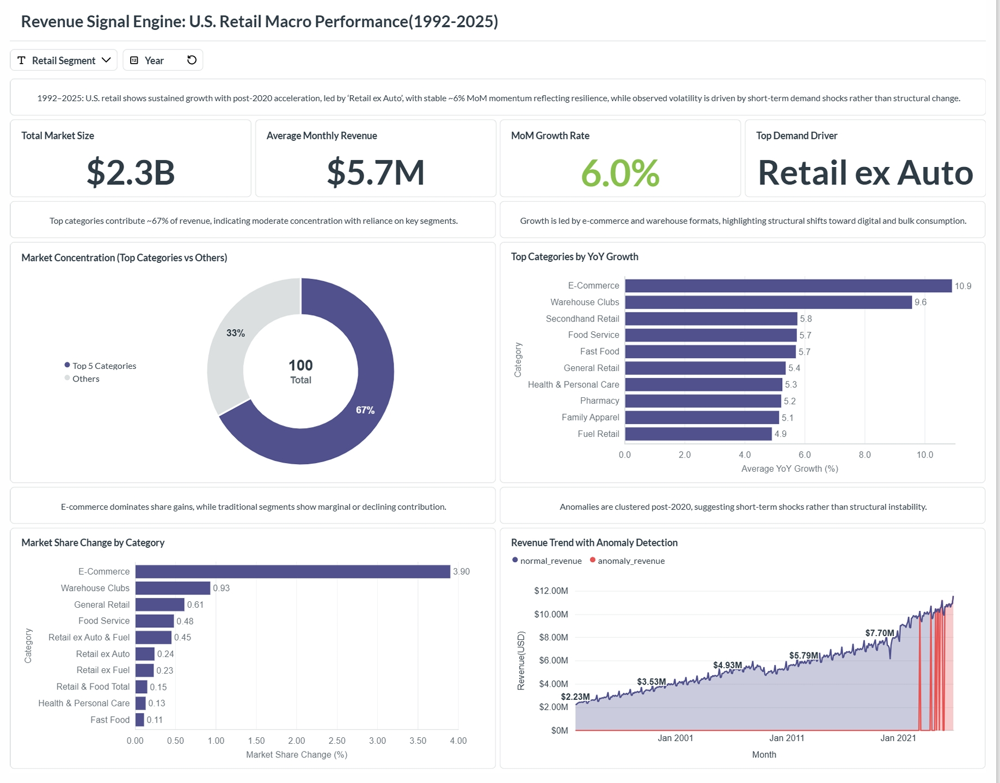
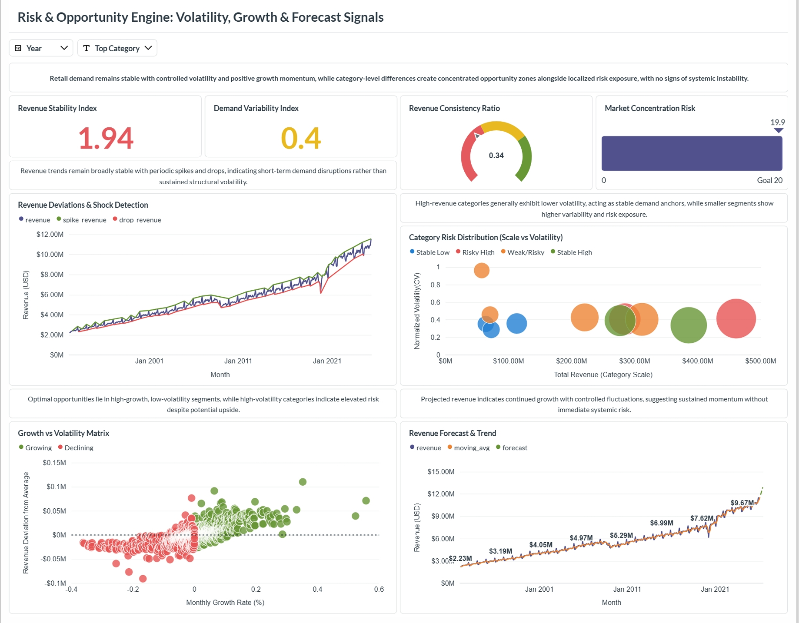
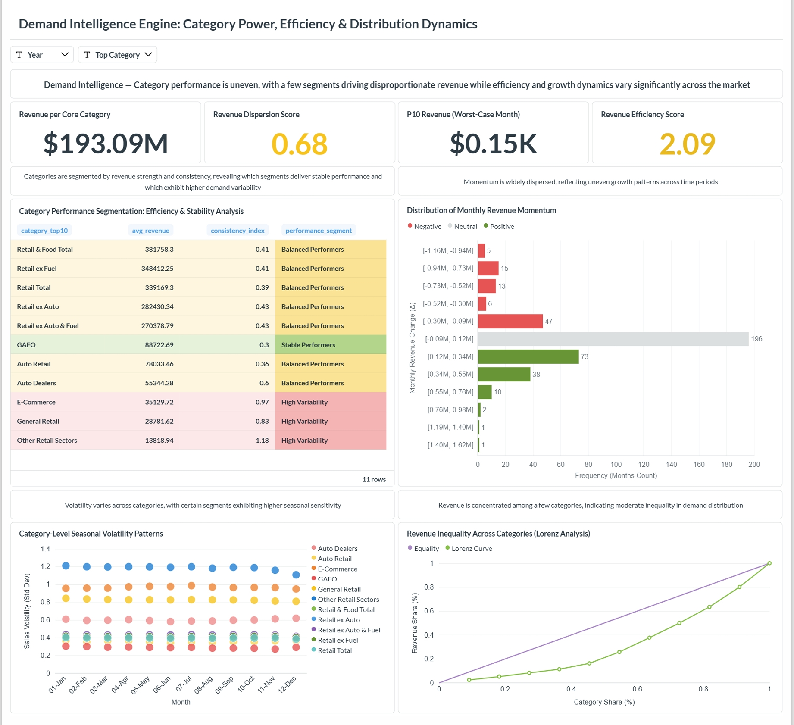

# 📊 U.S. Retail Intelligence & Analytics Platform

An end-to-end data analytics project built using U.S. Census retail data to analyze long-term growth, identify risk patterns, and evaluate category-level performance.

---

## 🚀 Project Overview

This project converts raw retail sales data into actionable insights using a structured three-layer analytics approach:

- 📈 **Revenue Signal Engine** → Macro-level growth analysis  
- ⚠️ **Risk & Opportunity Engine** → Volatility and forecasting  
- 🧠 **Demand Intelligence Engine** → Category-level insights  

---

## 🏗️ Data Pipeline

### 📥 Data Sourcing
- Source: U.S. Census Bureau (Monthly Retail Trade Survey)  
- Format: 34 CSV files (1992–2025)  

### ⚙️ ETL Process
- Tool: Python (Pandas, NumPy)  
- Cleaned and standardized data  
- Merged multiple files into a single dataset  

**Output:** Master dataset (~4,500 rows)

---

### 🗄️ Data Storage
- Platform: Supabase (PostgreSQL)  
- Used for storing structured data  
- Optimized for SQL-based analysis  

---

### 🧩 Application Hosting
- Platform: Hugging Face Spaces (Docker)  
- Hosted Metabase for dashboard access  

---

### 📊 BI & Visualization
- Tool: Metabase  
- Built interactive dashboards using SQL  

---

### 🌐 Deployment
- Public dashboards shared via links  
- Managed using Bitly  

---

## 📁 Dashboard 1 — Revenue Signal Engine  
### U.S. Retail Macro Performance (1992–2025)

🔗 **Live Dashboard:** https://bit.ly/us-retail-macro-signals

🖼️ **Screenshot:**  

### Overview
Analyzes long-term retail performance and identifies growth patterns and anomalies.

---

## 📁 Dashboard 2 — Risk & Opportunity Engine  
### Volatility, Growth & Forecast Signals

🔗 **Live Dashboard:** https://bit.ly/us-retail-risk-engine

🖼️ **Screenshot:**  

### Overview
Focuses on demand volatility, stability, and forecasting trends.

---

## 📁 Dashboard 3 — Demand Intelligence Engine  
### Category Performance, Efficiency & Distribution

🔗 **Live Dashboard:** https://bit.ly/us-retail-category-intel

🖼️ **Screenshot:**  

### Overview
Analyzes category-level performance, efficiency, and revenue distribution.

---

## 🛠️ Tools & Technologies

- 🐍 Python (Pandas, NumPy)  
- 🗄️ PostgreSQL (Supabase)  
- 📊 Metabase (Dashboarding)  
- 🐳 Docker (Hugging Face Hosting)  
- 💻 SQL (Analytics & Queries)  

---

## 📌 Key Highlights

- Built a **3-layer analytics system** (Macro → Risk → Category)  
- Used **advanced SQL (CTEs, window functions)**  
- Applied **statistical methods (CV, Z-score, Percentiles)**  
- Designed **interactive dashboards with real data**  

---

## 🧩 Project Architecture

- U.S. Census Data  
  ↓  
- Python (Data Cleaning)  
  ↓  
- Supabase (PostgreSQL)  
  ↓  
- Metabase (Dashboards)  
  ↓  
- Hugging Face (Hosting)  
  ↓  
- Public Links (Bitly)  

---

## 👩‍💻 Author

**K Jevaneswari**